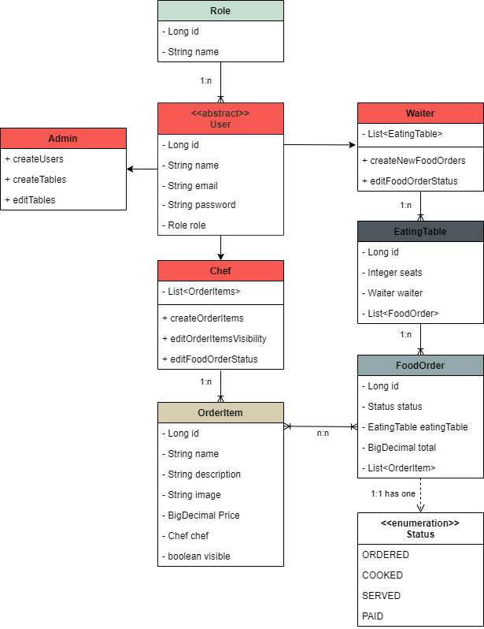
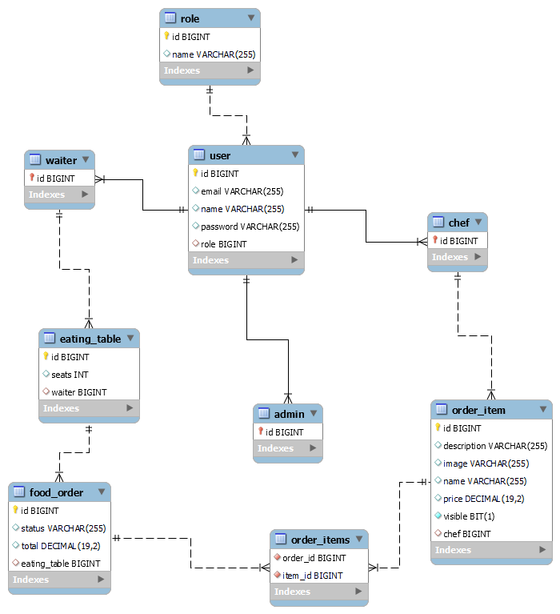

# READY 2 ORDER - Server

## DESCRIPTION OF THE PROJECT

This project consists of a simple restaurant managing system, in which registered employees, eating tables, food orders and order items are held. 

Registered employees either can be administrators, chefs or waiters. Each of them has different functionalities available. Administrators are responsible for creating both any kind of user and table and editing the last ones. They can also have access to every part of the database. Chefs are responsible for creating new order items, changing their visibility and changing an order's status from ordered to cooked when the order is ready to be served. Waiters are responsible for creating new orders and editing or deleting them, and they can access all their orders and tables. 

## USER STORIES

- *As an anonymous user, I want to read the menu so I can decide what I want to order.*
- *As an admin, I want to be able to register different employees so they can access the app and work.*
- *As an admin, I want to create new tables or edit them.*
- *As an admin, I want to see all the orders of the restaurant.*
- *As a chef, I want to add new order items so clients can order them.*
- *As a chef, I want to be able to hide order items so clients can't order them anymore.*
- *As a chef, I want to be able to change an order's status so waiters can pick it up.*
- *As a waiter, I want to be able to create new orders so I can write down clients' desires and send them to the kitchen.*
- *As a waiter, I want to be able to change an order's status when the order is served and paid.*

## TECHNOLOGIES USED

The project has been developed using Java 17 Spring Boot. For managing data, the technology chosen has been MySQL. Authentication is handled by Spring Security. 

## MODELS

The following diagrams show the structure of the whole project.

*Class diagram*

*MySQL reverse engineer.*

## SERVER ROUTES TABLE

METHOD | ENDPOINT | AUTHORITIES | DESCRIPTION 
--- | --- | --- | --- 
`POST` | http://localhost:5005/auth/login | NONE | Registerd users can log in with their email and password 
`GET` | http://localhost:5005/api/orderItems/visibles | NONE | Anonymous get all the visible order items from the database
`POST` | http://localhost:5005/auth/signup | ADMIN | Admins can register new users and save them in the database
`GET` | http://localhost:5005/api/users | ADMIN | Admins can get all the registered users from the database
`GET` | http://localhost:5005/api/eatingTables | ADMIN | Admins can get all the eating tables from the database
`GET` | http://localhost:5005/api/eatingTables/{id} | ADMIN | Admins can get eating tables by their id from the database
`POST` | http://localhost:5005/api/eatingTables | ADMIN | Admins can create new eating tables and save them in the database
`PUT` | http://localhost:5005/api/eatingTables/{id} | ADMIN | Admins can edit eating tables by id from the database
`GET` | http://localhost:5005/api/foodOrders | ADMIN | Admins can get all the food orders from the database
`GET` | http://localhost:5005/api/waiters | ADMIN | Admins can get all the waiters from the database
`GET` | http://localhost:5005/api/waiters/eatingTables | WAITERS | Waiters can get all their tables from the database
`GET` | http://localhost:5005/api/foodOrders/eatingTables/{id} | WAITER | Waiters can get all the orders of a certain eating table by its id from the database
`POST` | http://localhost:5005/api/foodOrders | WAITER | Waiters can create and save new food orders in the database
`GET` | http://localhost:5005/api/foodOrders/{id} | WAITER | Waiters can get food orders by their id from the database
`GET` | http://localhost:5005/api/foodOrders/cooked/waiter | WAITER | Waiters can get all their cooked food orders from the database
`GET` | http://localhost:5005/api/foodOrders/served/waiter | WAITER | Waiters can get all their served food orders from the database
`PATCH` | http://localhost:5005/api/foodOrders/{id} | WAITER & CHEF | Waiters and chefs can update food order's status by its id and save it in the database
`PUT` | http://localhost:5005/api/foodOrders/{id} | WAITER | Waiters can edit certain food order by its id and save it to the database
`DELETE` | http://localhost:5005/api/foodOrders/{id} | WAITER | Waiters can delete certain food order by its id from the database
`GET` | http://localhost:5005/api/foodOrders/status/ordered | CHEF | Chefs can get all the ordered food orders from the database
`POST` | http://localhost:5005/api/orderItems | CHEF | Chefs can create new order items and save them to the database
`GET` | http://localhost:5005/api/orderItems | CHEF | Chefs can get all the order items from the database
`PATCH` | http://localhost:5005/api/orderItems/{id} | CHEF | Chefs can change an order item's visibility by its id and save it to the database

## FUTURE WORK

In the future the project could be improved by adding some editing features (edit order items and users for example). The project will also improve its usability by adding a date property to the order model so that it would be easier to find them. The order item model could be expanded also so that it holds a type defining wether the item is a drink or a dish and depending on that defining if it contains any alcohol or allergens.

Link to my trello board : https://trello.com/b/MNwKmZfn/final-project

Presentation slides: https://docs.google.com/presentation/d/1f_WBci4Y4_1l_n5YL7tu6_HevMNlDNcMf0zi4EBuMmM/edit?usp=sharing

*A project by Olatz Izagirre.*
